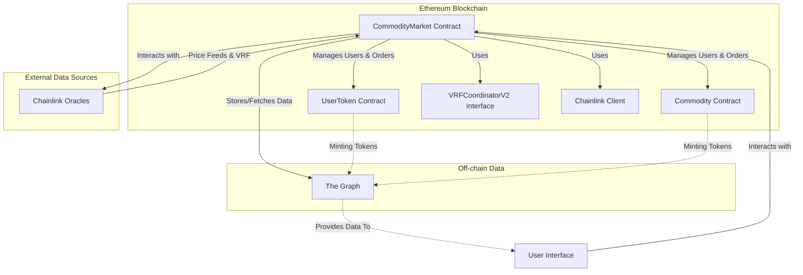
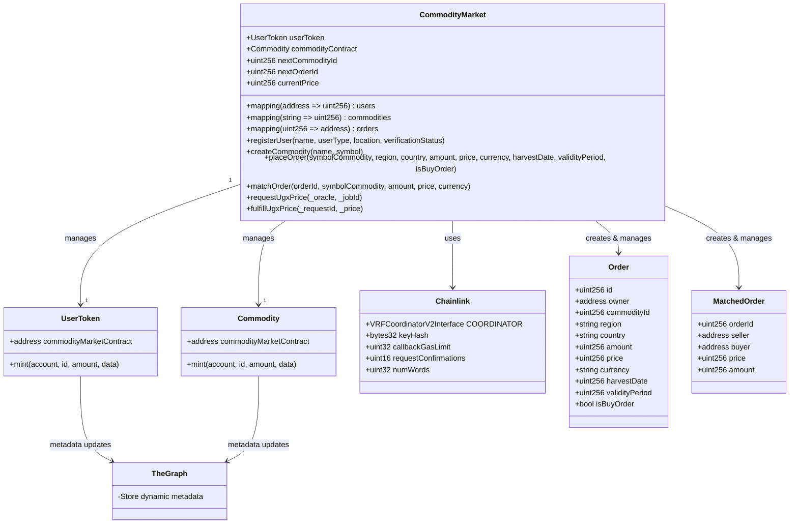

# Commodity Market Ticker Project

## Project Overview

### Vision and Goal
**Vision:** Empower small-scale farmers and traders/exporters by optimizing resource allocation and market operations through blockchain technology.

**Goal:** Develop a decentralized platform for seamless communication between farmers and exporters/traders, enhancing market transparency and integrating modern transaction methods.

## Overall Architecture

### System Description
The system is structured on Ethereum blockchain, incorporating smart contracts for market operations, off-chain data management with The Graph, and real-time data integration using Chainlink.

### Architecture Diagram

## Users/Participants and Their Needs

- **Small-scale Farmers:** Need access to a wider market, transparent pricing, and easy transaction processes.
- **Traders/Exporters:** Seek reliable market data, streamlined commodity access, and efficient trading mechanisms.
- **System Administrators:** Oversee platform operations, manage commodity listings, and ensure system integrity.

## Interactions/Sequences

1. **User Registration:** Users create profiles, receiving unique NFTs.
2. **Commodity Management:** Admins list commodities; producers mint commodity tokens for sell orders.
3. **Order Placement & Matching:** Users engage in buy/sell orders, matched by the system.
4. **Real-time Data Updates:** Utilizing Chainlink for price feeds and VRF.
5. **Transaction Execution:** Completing trades with commodity transfers.

## Data Model

- **User Profiles:** Represented as ERC-1155 NFTs, with metadata managed on The Graph.
- **Commodities:** Tokenized commodities with related trade data stored on The Graph.
- **Orders:** Managed through smart contracts, detailing trade specifics.
- **Matched Orders:** Records of completed trades, including participant details and transaction specifics.

## Deployment

The Commodity Market Ticker smart contract is deployed on the Sepolia network:
[CommodityMarket Contract on Sepolia](https://sepolia.etherscan.io/address/0xEbDc891011504E58404Fb39f2c362c57414faab4)

## Subgraph

The Commodity Market Ticker subgraph is available at:
[Subgraph on The Graph Studio](https://api.studio.thegraph.com/query/33148/commodity-market-ticker/v0.0.1)
