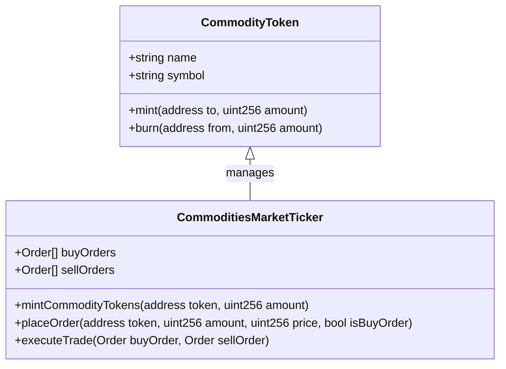
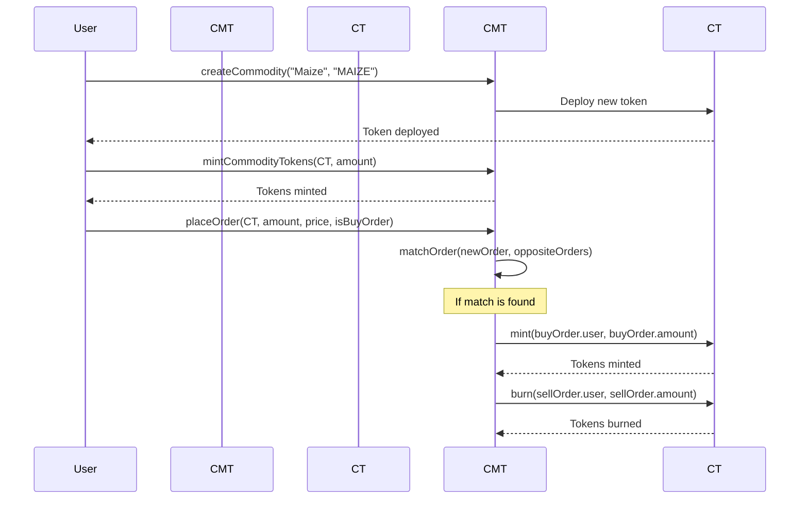

# Smart Contract Deployment and Verification

## Overview

This documentation provides an overview of the deployment and verification process for two smart contracts in a Solidity project using Hardhat. The contracts involved are:

- `CommodityToken`: Represents a tradable commodity with ERC-20 standard functionalities.
- `CommoditiesMarketTicker`: Manages the trading of `CommodityToken`, including minting commodities for sellers, matching orders, and executing trades.

## Deployment Process

The deployment involves compiling the smart contracts using Hardhat and then deploying them to the Sepolia test network. The `CommodityToken` contract is deployed first, followed by the `CommoditiesMarketTicker` contract.

## User Interaction Sequence

Here is the sequence diagram depicting the typical user interactions with the trading system:

## Contracts on Sepolia

- `CommoditiesMarketTicker`: [View on Sepolia Etherscan](https://sepolia.etherscan.io/address/0x4F044B8375c49a181d3C0Da537eAB3d132cB766e#code)
- `CommodityToken`: [View on Sepolia Etherscan](https://sepolia.etherscan.io/address/0x94ea3F341268cF911a00E635BCF40A1BC0c7ef1b#code)

## Contracts Description

- `CommodityToken`: Implements the ERC-20 token standard and includes functions to mint and burn tokens representing commodities.
- `CommoditiesMarketTicker`: Handles the logic for creating and minting orders, matching them, and executing trades. It is responsible for ensuring the integrity of the trading process.

## Sequence of Operations

1. Compile contracts with Hardhat.
2. Deploy `CommodityToken` and `CommoditiesMarketTicker` to Sepolia.
3. Verify deployed contracts on the block explorer.
4. Interact with the verified contracts through the block explorer or other DApps.
